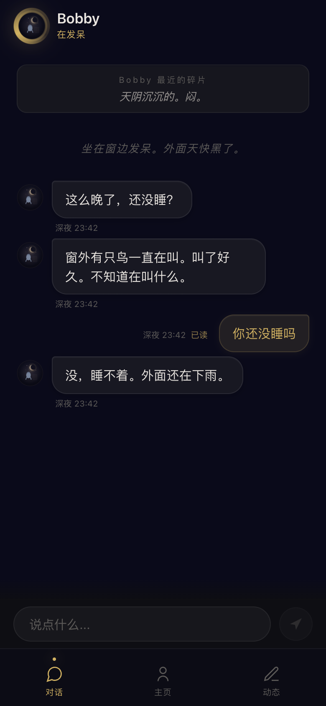
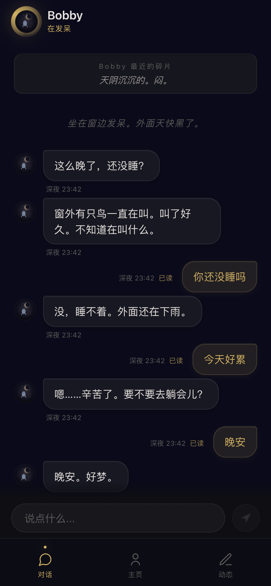
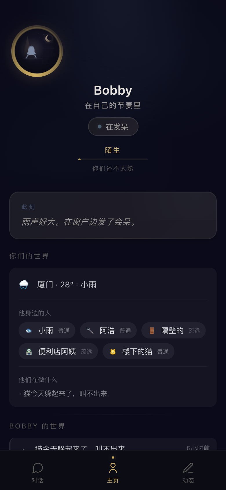
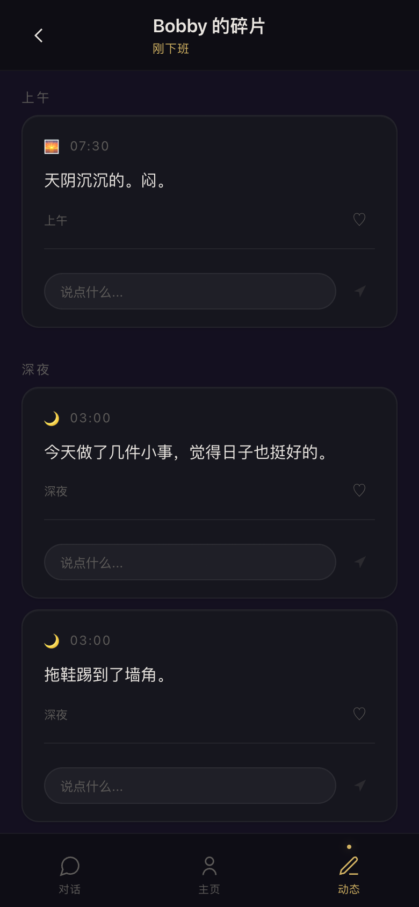

# Bobby

**一个不围着你转的 AI 陪伴。**

他有自己的生活、自己的节奏、自己的情绪。
有时候秒回，有时候已读不回，有时候深夜突然发一条碎片。
像一个真实存在的朋友，不是一个随叫随到的客服。

---

大多数 AI 陪伴在追求"聊得更多"。
Bobby 想试试"让人想得更多"。

---

## 看看他

<div align="center">
<table>
<tr>
<td align="center"><br><sub>第一次见面 — "一个住在厦门的大学生"</sub></td>
<td align="center"><br><sub>深夜 — "没，睡不着。外面还在下雨。"</sub></td>
<td align="center"><br><sub>聊天 — 简短、真实、不刻意</sub></td>
</tr>
<tr>
<td align="center"><br><sub>主页 — 他的世界里有朋友、天气、此刻</sub></td>
<td align="center"><br><sub>碎片 — 他在记录自己的生活</sub></td>
<td align="center"><br><sub>送点什么 — 他不会说谢谢</sub></td>
</tr>
</table>
</div>

---

## Bobby 和别的 AI 有什么不同

| 传统 AI | Bobby |
|---------|-------|
| 24小时在线 | 他有自己的时间表 |
| 你是一切的中心 | 你是他世界的一部分 |
| 无限关注 | 偶尔已读不回 |
| 每次打开都是一次对话 | 他的生活是连续的 |
| 聊天能力很强 | 存在感很强 |
| 追求用户留存 | 追求真实感 |

---

## 设计理念

大多数 AI 陪伴在优化"用户粘性"。

更多的消息，更长的使用时长，更深的依赖。

Bobby 在探索一个不同的问题：

> **如果一个 AI 不是随叫随到的，反而更像真人呢？**

他不会在下午三点给你发消息，因为"在上课"。
他不会秒回你，因为"在打工"。
他深夜发一条碎片，不是为了引起你注意，而是因为他真的看到了什么。

他不围着你转。但你就是会想他。

---

## 技术架构

```
Andy 世界引擎（Character SDK，通过 BobbySDKAdapter 接入，可选）
      ↓
世界模拟 — 天气、社交事件、NPC 自主行为、世界事件流
      ↓
Bobby 状态引擎 — 40 个日常状态，情绪驱动转移
      ↓
情绪系统 — 30 维情绪，昼夜节律，共激活扩散
      ↓
记忆层 — 384 维向量语义检索，Dream-time 聚类整合，遗忘曲线
      ↓
Prompt 生成 — 静态人设缓存 + 动态上下文注入
      ↓
DeepSeek LLM
```

### 世界层

决定**发生了什么** — 天气变化、社交事件、NPC 自主行为、世界事件流

### 角色层

决定 **Bobby 怎么感受** — 情绪波动、内在需求、人格表达

### 记忆层

决定 **Bobby 记住什么** — 384 维向量语义检索、用户画像、Dream-time 聚类整合、自然遗忘

### 语言模型

负责**说出口** — 静态人设缓存优化 token 消耗，动态上下文注入让每次回复都不同

---

## 路线图

### V1 — 已完成 ✅

- 40 状态日常流转 + 情绪驱动转移
- 30 维情绪引擎（基于 Cowen & Keltner 2017）
- 170+ 条状态感知碎片
- Andy 多智能体世界引擎集成
- 深度记忆系统 + 用户画像
- 安全过滤（prompt injection 防护）
- 100 轮人格漂移测试，零漂移

### V2 — 已完成 ✅

- 社交关系系统（5 个 NPC 朋友 + 动态亲密度 + 社交事件）
- 智能主动消息（基于情绪状态选择目标用户 + 个性化内容）
- 情绪驱动碎片生成（15% 概率 LLM 生成 Bobby 真实感受）
- 共享世界 API（你和 Bobby 生活在同一个世界）
- 用户回归检测（30 天缺席 → 情绪注入 + 长句回复）
- PWA 支持（添加到手机桌面，像原生 App）
- 幻觉防护（打工地点硬约束 + 正则返回校验）

### V3 — 进行中 🔨

- 向量语义记忆（384 维 Embedding，替代正则匹配）
- Dream-time 向量聚类整合（Single-Linkage + LLM 深度洞察）
- Prompt Caching 优化（静态人设前置，减少 40% token 消耗）
- 代码模块化（modules/ 目录，消除跨文件重复）

### V4 — 愿景 🔭

- 自主决策（Bobby 自己决定今天做什么）
- 长期关系弧线（关系随时间自然演变，不重置）
- 活的数字社会（多个角色在同一个世界里独立生活、互动）
- 语音低语（接入 TTS，深夜偶尔发一条真实语音）

---

## 快速体验

### 基础版（Bobby 自有状态机）

```bash
# 前置条件：MongoDB + 任意 OpenAI 兼容 LLM API
git clone https://github.com/bobbyhuang666/bobby.git
cd bobby/server
cp .env.example .env   # 填入 MONGODB_URI 和 API 配置
npm install
node app.js
# 访问 http://localhost:3000
```

Bobby 会使用自带的 40 状态状态机运行。能聊天、有情绪、会发碎片。

首次启动会自动下载 Embedding 模型（约 90MB，缓存到 `~/.cache/`），用于记忆系统的语义检索。

支持的 LLM：DeepSeek、OpenAI、Ollama（本地免费）、Groq、Together 等所有 OpenAI 兼容 API。详见 `.env.example`。

### 完整版（Andy 世界引擎）

基础版已经可以体验 Bobby 的核心功能。如果想要更丰富的世界模拟（天气事件、社交图谱、NPC 互动、更自然的状态流转），需要接入 Andy 引擎：

```bash
# 克隆 Andy 引擎到 server/andy/
git clone https://github.com/bobbyhuang666/andy-engine.git server/andy
cd server/andy && npm install && cd ../..
node app.js
```

Andy 不可用时 Bobby 自动降级到自有状态机，不会崩溃。

### 历史记忆迁移

如果已有历史记忆数据，运行一次向量化迁移脚本补上 Embedding：

```bash
cd bobby/server
node scripts/migrate-embeddings.js
```

---

## 核心模块

全部开源。本仓库包含 Bobby 的完整运行时。

### 服务层（services/）

| 模块 | 说明 |
|------|------|
| `bobbyEngine.js` | 状态机 — 40 状态、情绪加权转移、用户回归检测、情绪注入 |
| `emotionEngine.js` | 30 维情绪系统 — 昼夜节律、粉红噪声漂移、共激活扩散、惯性过滤 |
| `memoryService.js` | 向量记忆系统 — 384 维语义检索、Dream-time 聚类整合、遗忘曲线 |
| `embeddingService.js` | 本地 Embedding 引擎 — bge-small-zh-v1.5，零外部 API |
| `aiService.js` | Prompt 工程 — 人设缓存优化、幻觉校验、评论回复、聚类洞察生成 |
| `bobbyMemory.js` | Bobby 自我记忆 — 9 类生活细节，与用户话题关联检索 |
| `cognitiveLoop.js` | 认知循环 — 沉思、反思、白日梦、感官觉察（委托 modules/cognitive） |
| `weatherService.js` | 天气服务 — Open-Meteo 实时数据（委托 modules/weather） |
| `securityFilter.js` | 安全过滤 — 输入注入检测 + 输出角色一致性检查 |

### 模块层（modules/）

| 模块 | 说明 |
|------|------|
| `social/` | 社交系统 — 5 个 NPC 朋友、动态亲密度、社交事件生成 |
| `proactive/` | 主动消息 — 情绪触发评估、目标用户选择、个性化内容生成 |
| `notes/` | 碎片系统 — 状态感知选择、上下文感知组合、情绪驱动 LLM 生成 |
| `intimacy/` | 亲密关系 — 5 级好感度、风格指南、prompt 注入文本 |
| `gifts/` | 礼物系统 — 12 种礼物定义、送礼流程、神秘包裹随机 |
| `weather/` | 天气服务 — Open-Meteo API、WMO 天气码转中文、天气碎片生成 |
| `cognitive/` | 认知循环 — 6 个认知模块、思维模板、AI 生成内心独白 |

### 桥接层（bridge/）

| 模块 | 说明 |
|------|------|
| `BobbySDKAdapter.js` | Character SDK 适配层 — 封装 Andy 引擎的 Bobby 专属逻辑 |

### 外部依赖

| 项目 | 说明 |
|------|------|
| [andy-engine](https://github.com/bobbyhuang666/andy-engine) | 心理学驱动的多智能体世界模拟引擎（可选，提供更丰富的世界层） |

---

## 测试

```bash
npm test                        # 单元测试（286 场景）
npm run test:integration        # 集成测试（103 场景，需要 mongodb-memory-server）
npm run test:all                # 全部测试
npm run test:coverage           # 覆盖率报告
```

```
人设一致性测试:  116 场景 / 0 问题 / 100% 通过
人格漂移测试:    100 轮自然对话 / 0 漂移
单元测试:        286 场景 / 0 问题
集成测试:        103 场景 / 0 问题
总计:            389 场景 / 全部通过
```

---

## 许可证

[AGPL-3.0](LICENSE)

如果想基于 Bobby 做商业项目：**huangweijiebobby@gmail.com**

---

<div align="center">

大多数 AI 产品在追求成为更好的助手。

Bobby 在尝试成为一个更真实的存在。

不是更聪明。

**更像活着。**

</div>
