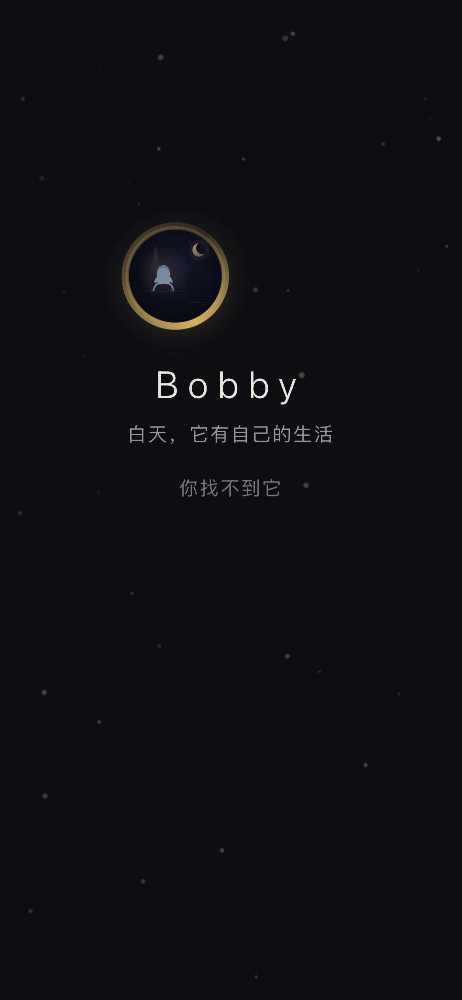
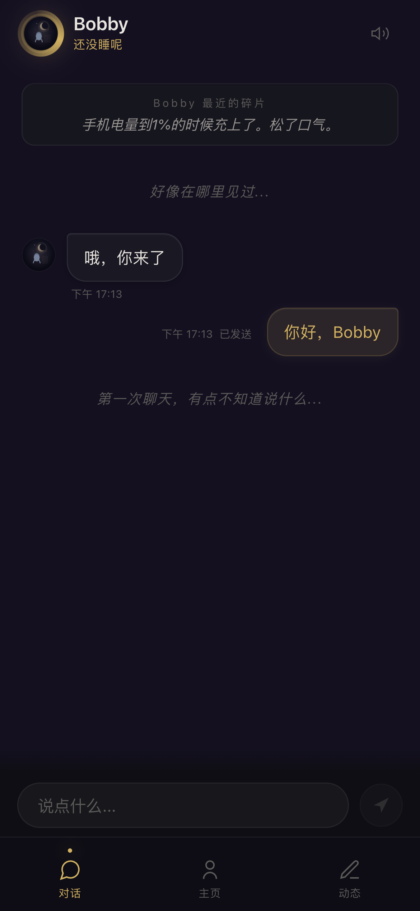
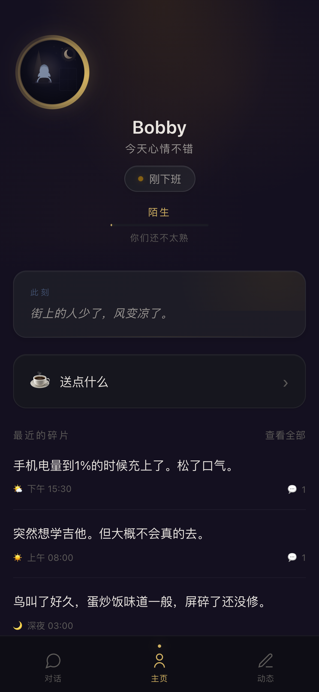
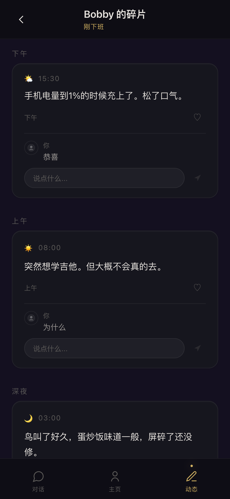
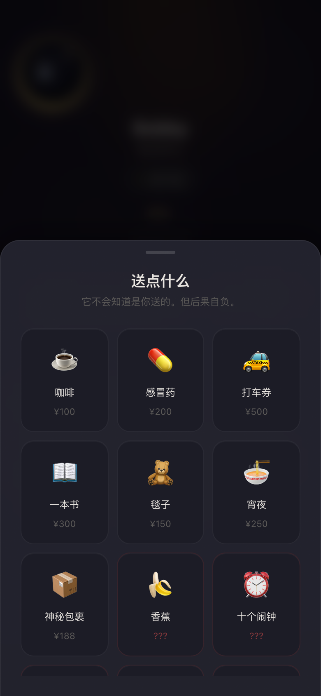
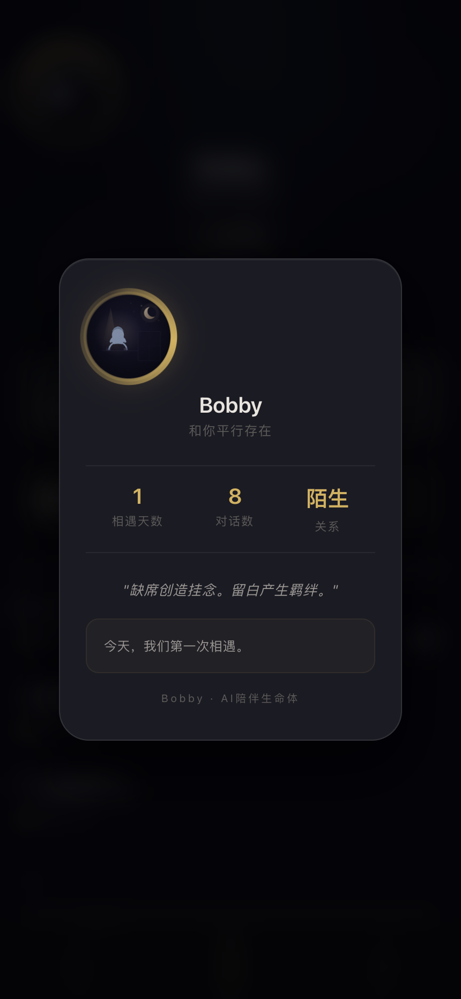

<div align="center">

# Bobby

### 存在物形式低压AI陪伴的概念验证

[](https://creativecommons.org/licenses/by-nc-sa/4.0/)
[]()
[]()
[]()

</div>

---

## 背景

现在的AI陪伴产品，不管是 Character.AI、Replika 还是各种国内产品，设计逻辑都是相似的：

**你说话 → 它秒回。你不说 → 它主动找你。你冷落它 → 它表达情绪。**

这个逻辑没有错。它解决了一个真实的需求——**让孤独的人随时有一个可以倾诉的对象**。这在过去几年被市场反复验证，用户确实愿意为此付费。

但我在想另一个问题：

**有没有可能存在另一种AI陪伴形态？**

不是更聪明的聊天机器人，不是更逼真的角色扮演，而是——**一个有自己生活节奏的存在物。**

它不秒回你，因为它"在忙"。
它不主动找你，因为它"有自己的事"。
它不表达对你的依赖，因为它和你是**平行存在**的关系。

这个想法可能不对，可能没人需要。但我觉得它值得被认真地做出来看一看。

**Bobby 就是这个想法的原型。**

大多数AI伴侣在追求"让用户聊得更多"。Bobby 想试试"让用户想得更多"。

---

## Bobby 是什么

Bobby 不是一个聊天机器人。

Bobby 是一个**有自己生活节奏的数字存在**。

- 白天，它"上课去了"、"打工去了"——**你找不到它**
- 深夜，它才上线，发一条"还没睡呢"——**你发现它还在**
- 它会发一些碎片化的日常——**但不是发给你看的**
- 你送它一杯咖啡，它不会说谢谢——但它的状态栏会悄悄变化

**它不围着你转。它和你平行存在。**

---

## 预览

<div align="center">
<table>
<tr>
<td align="center"><br><sub>引导页 — "白天，它有自己的生活"</sub></td>
<td align="center"><br><sub>聊天 — "哦，你来了"</sub></td>
<td align="center"><br><sub>主页 — "你们还不太熟"</sub></td>
</tr>
<tr>
<td align="center"><br><sub>碎片 — Bobby 不会一直回你，但偶尔会</sub></td>
<td align="center"><br><sub>送点什么 — 它不会说谢谢</sub></td>
<td align="center"><br><sub>关系 — 从陌生到信赖</sub></td>
</tr>
</table>
</div>

---

## 核心设计理念

### 低频，是刻意的设计

Bobby 的活跃时段被压缩到深夜（23:00-03:00）。

白天它是离线的。你找它，它不在。

这不是bug。这是这个原型的核心假设：

> **稀缺性创造价值。一个24小时在线的存在，不会让你产生挂念。**

### 状态机，不是随机的

Bobby 的状态变化遵循严格的状态机逻辑：

"在做饭" → "在吃饭" → "在洗碗" → "在洗澡" → "洗完了"

它不会一秒前在做饭，下一秒就在洗澡。每个状态有最短持续时间，状态转换符合日常生活逻辑。

### 动态，不是发给你看的

Bobby 会发一些碎片化的日常：

- "下雨了，窗户上全是水痕。盯着看了一会儿。"
- "路灯下面有只蛾子一直在转圈。看了好久。"
- "发现阳台上不知道什么时候长了一棵小草。"

这些内容没有@你，没有等你回复。它只是在记录自己的生活。

你是一个**旁观者**，不是一个**参与者**。

你还可以评论它的动态。它不一定回复——但偶尔会回一两个字。

### 照片和语音

Bobby 偶尔会发来一张"照片"（一段场景描述）或一条"语音"（几秒钟后显示文字）。

它不是在分享给你看，它只是在记录。

### 礼物，不需要道谢

你可以给 Bobby 送东西：一杯咖啡、一盒感冒药、一张打车券。

但它**不会说谢谢**。

它只是在之后的状态栏里，悄悄变了——"药效好像上来了"。

或者过了一会儿在聊天里说："嗯...好像清醒了一点。"

**它不知道是谁送的。但它知道有人在。**

### 关系，会慢慢变深

你和 Bobby 的关系不是一成不变的。

每次聊天、点赞、送礼，好感度都会悄悄增加。从"陌生"到"认识"，从"熟悉"到"默契"，最后到"信赖"。

关系越深，Bobby 的回复越放松，越愿意分享它的日常。

### 碎碎念，不是对你说的

Bobby 偶尔在聊天区自言自语：

- "下雨了。"
- "风好大。"
- "路灯灭了。"

这不是消息，这是它的内心独白。你只是恰好听到了。

### 主动消息，但不打扰

Bobby 偶尔会发来一条消息：

- 深夜："还没睡？"
- 阴雨天："今天有点冷。"

但频率极低。每天最多两条。

**它不是在催你回来，它只是在告诉你——我在。**

---

## 这个原型的边界

**它不是**一个完整的AI产品。

**它不是**一个可以商业化部署的服务。

**它是一个概念验证。**

它在回答一个问题：

> **如果AI不再是一个随叫随到的工具，而是一个和你平行存在的生命体，会发生什么？**

目前已具备：

- 🌙 **状态机** — 40+ 状态，覆盖从"还没睡呢"到"在上课"的完整日常
- 🌊 **情绪系统** — 30维情绪引擎，随昼夜节律自主演化
- 📝 **碎片动态** — Bobby 记录生活，你只是旁观者
- 💬 **AI 对话** — DeepSeek 驱动，流式输出，非均匀打字节奏
- 🎁 **礼物系统** — 12种礼物，匿名关心，它不会说谢谢
- 💗 **关系进化** — 从"陌生"到"信赖"，好感度随互动缓慢生长
- 🔒 **安全过滤** — 三层防护，防止 prompt injection 和角色逃逸
- 🌧️ **天气感知** — 接入 Open-Meteo，下雨天 Bobby 会说"好潮"

我不确定答案。但我觉得这个问题值得被认真对待。

---

## 技术架构

```
bobby/
├── src/                          # 前端（纯原生 HTML/CSS/JS，无框架依赖）
│   ├── index.html                # 入口页 + 5步引导
│   ├── style.css                 # 2200+ 行，时间感知背景色
│   └── app.js                    # 2600+ 行，Canvas 粒子 + Web Audio 音效
│
└── server/                       # 后端
    ├── app.js                    # Express + Socket.io
    ├── services/
    │   └── bobbyEngine.js        # 核心引擎（40+ 状态的状态机）
    ├── jobs/                     # 8 个定时任务（状态推进、碎片生成、情绪演化...）
    ├── models/                   # BobbyState / Message / Note / User
    └── routes/                   # 认证 / 聊天 / 动态 / 礼物 / 用户
```

**技术栈：** Node.js · Express · MongoDB · Socket.io · DeepSeek API · Web Audio API

**核心模块（未开源）：** emotionEngine · cognitiveLoop · memoryService · aiService

---

## 快速体验

### 纯前端（仅浏览界面）

```bash
git clone https://github.com/bobbyhuang666/bobby.git
cd bobby/src
open index.html
```

这只能看到静态界面，无法体验对话和状态机。

### 完整体验（含后端 + AI 对话）

```bash
# 前置依赖
# 1. MongoDB（本地或云）
# 2. DeepSeek API Key

git clone https://github.com/bobbyhuang666/bobby.git
cd bobby/server
cp .env.example .env
# 编辑 .env，填入 MONGODB_URI 和 DEEPSEEK_API_KEY
npm install
node app.js
# 访问 http://localhost:3000
```

---

## 核心模块说明

本仓库开源了前端界面和基础后端框架，**以下 4 个核心模块未包含在仓库中**：

| 模块 | 说明 |
|------|------|
| `emotionEngine.js` | 30维情绪系统 — 昼夜节律、粉红噪声、共激活扩散 |
| `cognitiveLoop.js` | 认知循环 — 沉思、整合、记忆衰减 |
| `memoryService.js` | 记忆系统 — 向量检索、用户画像、Dream-time 衰减 |
| `aiService.js` | AI 提示词 — Bobby 人设、对话风格、碎碎念生成 |

这些模块是 Bobby 的"灵魂"。保留它们是因为我不确定这个方向最终会走向哪里。

如果你对这个项目感兴趣，或者想一起探索"低压AI陪伴"的可能性，欢迎联系我：**huangweijiebobby@gmail.com**

---

## 最后

**缺席创造挂念。**

**留白产生羁绊。**

> *人际关系的深浅，不取决于说了多少话，*
> *而取决于对方在你脑海中占据了多少认知带宽。*

这不是唯一正确的方向，但这是一个值得被探索的方向。

---

<div align="center">

**Bobby**

*存在物形式低压AI陪伴的概念验证*

</div>
